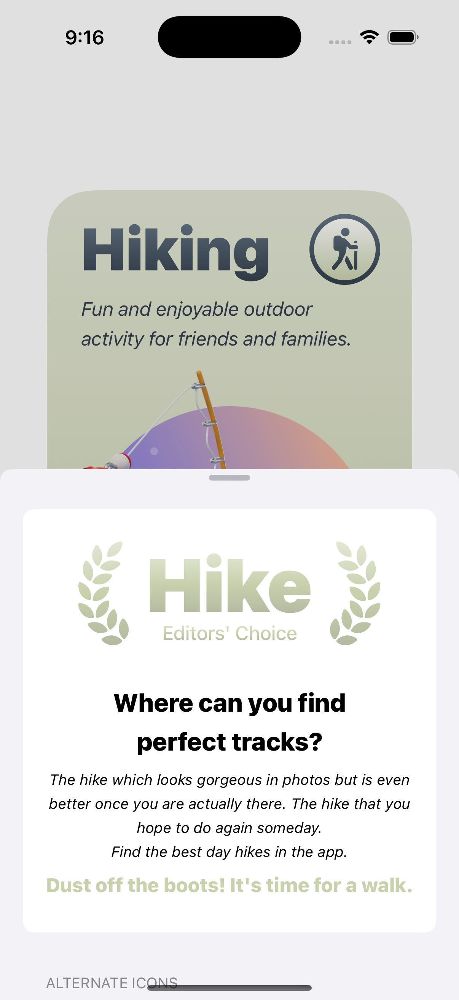

# 🥾 Hike – Explore Beautiful Trails with Friends & Family

<p align="center">
  
</p>

**Hike** is a simple yet elegant hiking companion app built for iOS and iPadOS. Designed to inspire people to explore the outdoors, Hike provides curated trail info, engaging visuals, and personalized features like alternate app icons. Whether you're a weekend adventurer or a family looking for a fun walk, Hike helps you get started.

---

## 📱 App Description

> “Fun and enjoyable outdoor activity for friends and families.”

Hike is your pocket-sized guide to discovering nearby trails and nature paths. With a friendly interface and delightful animations, it's the perfect tool to motivate you to dust off your boots and take that long-overdue walk.

The app is focused on delivering a clean, distraction-free user experience and inspires you to appreciate nature with subtle UI animations and warm visuals.

---

## 🖼️ App Image

| Welcome Screen | Trail Info | Editor's Pick |
|----------------|------------|----------------|
|  |  |  |
|  | Alternate Icons |  |

---

## 🎥 App Demo (GIF)


---

## 🌟 Features

- 🧭 **Minimal Onboarding** – Instant, interactive welcome for new users.
- 🗺️ **Editor’s Choice Trails** – Inspiring copy to motivate hiking.
- 🧍‍♂️ **3D Characters** – Animated and colorful avatar icons for engagement.
- 🎨 **Alternate App Icons** – Pick your favorite hiking avatar to personalize the app icon.
- 📄 **App Info Panel** – All the meta information about the app presented in a native iOS style.
- 🌓 **Dark Mode Support** – Beautifully adaptive UI for night-time users.

---

## 🛠 Technology Stack

| Layer            | Stack                     |
|------------------|---------------------------|
| Platform         | iOS, iPadOS               |
| Language         | Swift                     |
| UI Toolkit       | UIKit (and SwiftUI hybrid if applicable) |
| Version Control  | GitHub                    |
| Icon/Graphics    | Custom 3D illustrations   |

---

## 🏷 App Store Metadata Style Info

| Field           | Value                      |
|----------------|----------------------------|
| **App Name**    | Hike                       |
| **Category**    | Lifestyle / Travel         |
| **Platform**    | iOS / iPadOS               |
| **Minimum iOS** | 15.0                       |
| **Version**     | 1.0                        |
| **Languages**   | English                    |
| **Dark Mode**   | Supported                  |
| **Pricing**     | Free                       |

---

## 🧑‍💻 Developer Info

| Role        | Name              |
|-------------|-------------------|
| Developer   | Md. Hamid Hosen   |
| Designer    | Md. Hamid Hosen   |
| Website     | [Md. Hamid Hosen](#) (Add link) |
| GitHub Repo | [github.com/hamidhosen42/Hike](https://github.com/hamidhosen42/Hike) |

---

## 🚀 Getting Started

To run this project locally:

```bash
git clone https://github.com/hamidhosen42/Hike.git
cd Hike
open Hike.xcodeproj
```

- Requires Xcode 14+
- Target platform: iOS 15+

---

## 📃 License

MIT License  
© 2025 Md. Hamid Hosen

---

## 🙌 Acknowledgements

- Icon illustrations inspired by 3D adventure kits
- Swift community and UIKit animation best practices
- View controller structure adapted from App Store Showcase examples